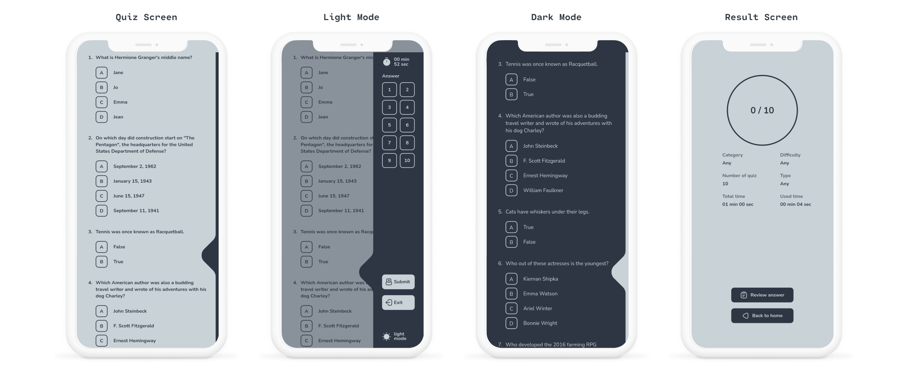

# Flutter Quiz

A quiz application contains a collection of number of different types of quizzes like technical, games, sports, etc. Questions are taken from the Open Trivia Database API.

## Screenshot

<!--  -->

